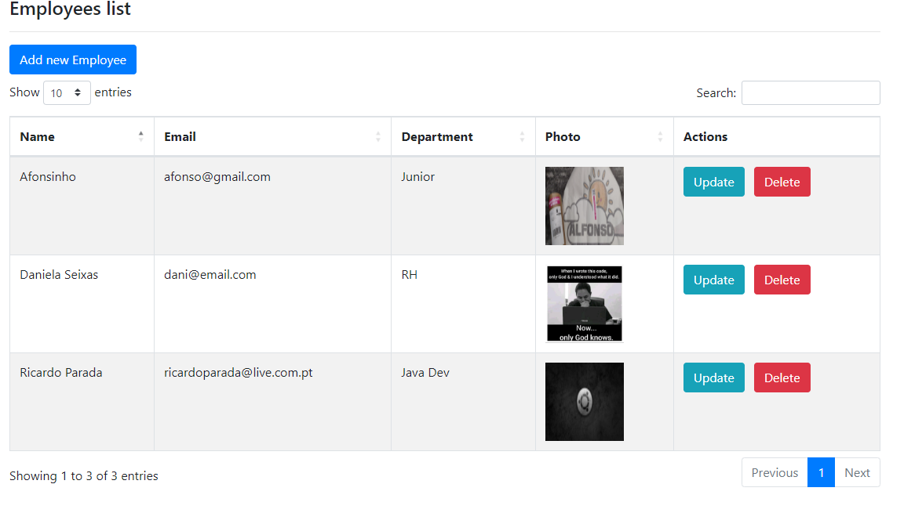
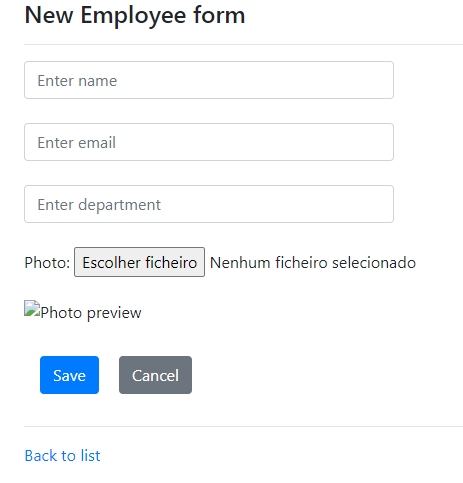

# React application: The-Movie-Database Rest API

## About
The following repo contains a Spring Boot application with CRUD

## I've learned:
* how to add multiple paths for a single view
* the usefulness of ModelAndView
* had no idea that to add an image could be so complicated :)
  * learned to use MultipartFile
  * learned about StringUtils class
    * learned how to get the complete path of a file
  * learned about Path class
  * learned about Files class
  * learned about InputStream class
  * learned the necessity of WebMvcConfigurer in order to @Override addResourceHandlers
  * learned that having a public class named "getPhotoPath" from main class Employee, that thymeleaf will understand that this code is asking for it:
    ```
    <img th:src="@{${employee.photoPath}}"
    ```
* use datatables

##  Run this application:
* create a postgres database named employeecrud
* open browser at:
```
http://localhost:8080/
```

## Routing:
* "/" index page:



* "/new" new employee form:



## Warning messages:


